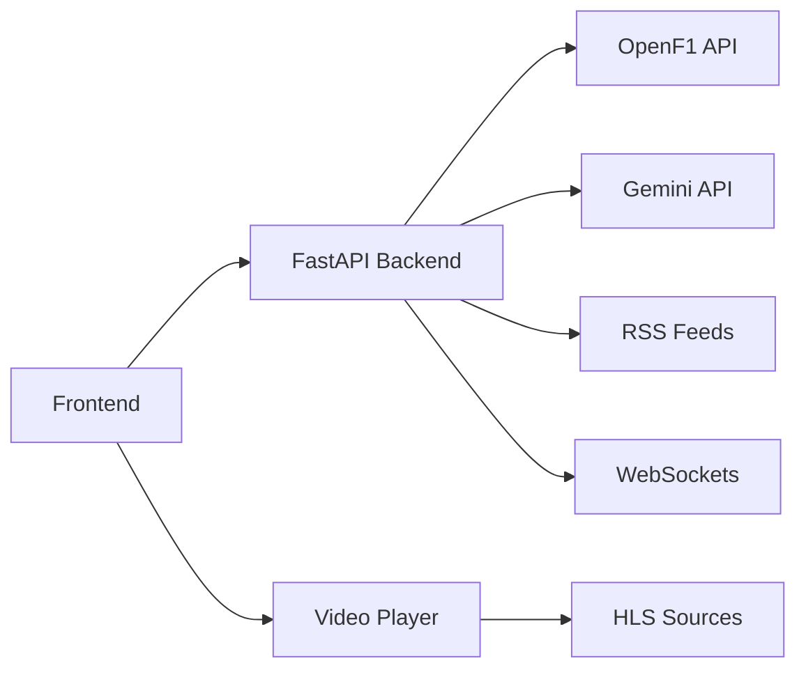

# 🏎️ Liberty Formula

**Open-source commentary platform for motorsport.**  
Built for commentators, streamers, and fans.  
Live telemetry, video, AI analytics, and race control — all in one place.

> **Neue Ära** · Apache 2.0 · [P4/9](https://github.com/RedRaceTeam)

---

## 📸 Preview


*Live telemetry, video player, and race control interface.*

---

## 🚀 Features

| Module | Description |
|--------|-------------|
| **Video Player** | HLS player with source switching (VK, WeAreChecking, Sportsurge, custom) |
| **Live Telemetry** | Positions, sectors, tyres, gaps, weather — updated via WebSockets |
| **Race Control** | FIA notifications: flags, incidents, lap deletions |
| **Track Map** | Real-time car positions on circuit map |
| **AI Analytics** | Gemini-powered commentary and race insights (Nico on AISTA) |
| **Commentator UI** | Sync controls, audio switching, quick actions |
| **Admin Panel** | Source management, logs, stream control |

---

## 🧠 Architecture



· Backend: FastAPI + WebSockets
· Frontend: HTML, CSS, JavaScript (modular)
· Video: Plyr + hls.js
· Data: OpenF1 API
· AI: Gemini API + AISTA (Nico)
· Deploy: Render / Vercel

---

🛠️ Quick Start

1. Clone the repository

```bash
git clone https://github.com/RedRaceTeam/Liberty_Formula.git
cd Liberty_Formula
```

2. Install dependencies

```bash
pip install -r requirements.txt
```

3. Set environment variables

Create a .env file:

```env
GEMINI_API_KEY=your_key
OPENF1_API_KEY=your_key
CHANNEL_ID=@your_channel
ADMIN_ID=your_telegram_id
```

4. Run the server

```bash
uvicorn main:app --reload
```

5. Open the app

Visit http://localhost:8000 in your browser.

---

📁 Project Structure

```
Liberty_Formula/
├── app/
│   ├── api/            # FastAPI routes
│   ├── core/           # Config, dependencies
│   ├── models/         # Pydantic schemas
│   └── services/       # OpenF1, Gemini, RSS
├── frontend/
│   ├── css/
│   ├── js/
│   └── index.html
├── nico/               # AISTA agent (separate)
├── tests/
├── .env.example
├── Dockerfile
├── requirements.txt
└── README.md
```

---

🤝 Contributing

1. Fork the repository.
2. Create a feature branch (git checkout -b feature/amazing).
3. Commit your changes (git commit -m 'Add amazing feature').
4. Push to the branch (git push origin feature/amazing).
5. Open a Pull Request.

---

📄 License

Apache 2.0 · P4/9

---

🔗 Links

· Repository: github.com/RedRaceTeam/Liberty_Formula
· Demo: p49dev.github.io/Liberty_Formula
· Support: donationalerts.com/r/kimi_redrace
· Telegram: @RedRaceF1

---

by P4/9 <3
